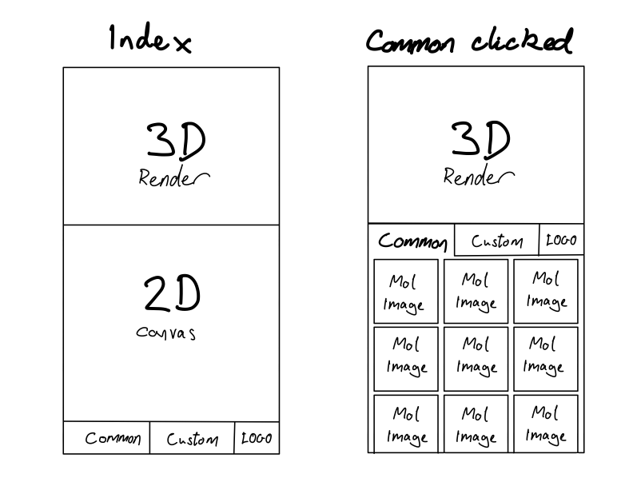
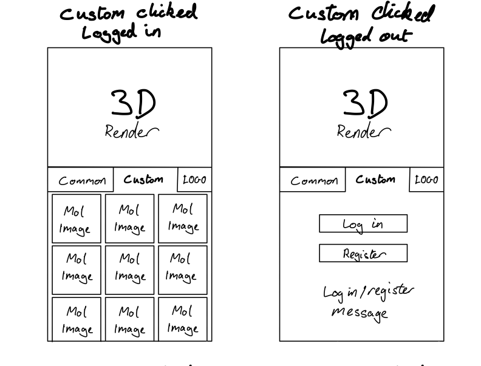
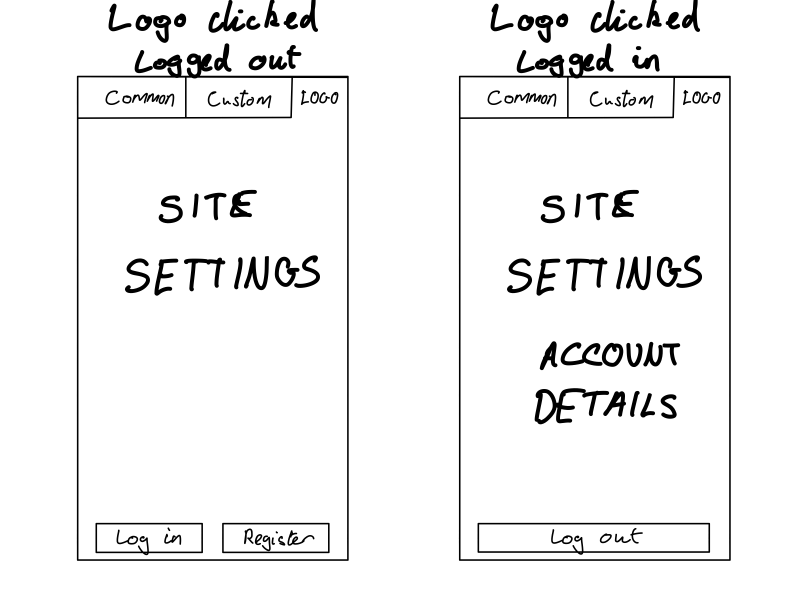

# Molymob

## Overview

A mobile friendly 3D visualiser for simple organic chemical molecules.

### Problem

At university, during my Chemistry degree, I was given a physical box of balls and sticks to put together in order to visualise molecular structure.

I always wanted to have a digital version of that on my phone so I didn't have to carry that box around with me. I would also be able to build bigger molecules and not be limitted by the very few bonds and atoms that could fit in the box.

### User Profile

My app is primary targetted at chemistry students through GSCEs, A levels, and Uni. It is also intended for someone on the go or who doesn't currently have convenient access to a laptop and would like ot use there phone instead.

### Features

- A user should be able to draw a molecule on a 2D canvas using their finger (mobile/tablet) or a mouse (desktop).
- A user should be able to see the 2D molecule rendered in 3D on the same screen.
- A user can pick from a list of common molecules that will then display on the canvas in 2D and the render environment in 3D.
- A user can login and save their custom molecules to reuse later.

## Implementation

### Tech Stack

- React
- TypeScript
- MySQL
- Express
- Client libraries:
  - react
  - react-router
  - axios
  - ChemDoodle web components
- Server libraries:
  - knex
  - express

### APIs

May use an API for fetching list of common molecules.

### Sitemap

I intend the site to have only one page containing the 2D canvas and 3D render environment. The added funtionality will be stored in a tray at the bottom of the page (on mobile) which will cover half the screen when opened and contain a tab with the common molecules, and a tab with custom molecules.

When the user is not logged in the custom molecule tray tab will contain buttons to login and register. If the user clicks on either of this buttons the tray will open to the full height of the screen and display the login/register form.

### Mockups

### Data

Exact fields for each table will be dependent on which chemistry package is used. This is the general structure of my data:

- User table: contains authentication information relating to user.
- Custom_molecule table: contains molecule information for custom user molecules with foreign ID to specific users.
- Common_molecule table: contains molecule information for the common molecules (if not being obtained from external API).

### Endpoints

Exact request/response bodies will be dependent on the package used so a rough outline for each endpoint is given below:

`GET /api/molecules`: Gets data for list of common molecules.

`GET /api/users/:userId/molecules`: Gets data for users custom molecules.

`POST /api/users/:userId/molecules`: Adds new molecule to custom_molecule table with user's ID.

#### Nice to have

Auth endpoints.

`DELETE /api/users/:userId/molecules/:moleculeId`: Deletes custom molecule for specific user.

`PUT /api/users/:userId/molecules/:moleculeId`: Edits custom molecule for specific user.

### Auth

I will initially fake the authentication functionality, which will allow the user to login and save their custom molecules.

## Roadmap

- Feat: 2D canvas

  - FE: Embed 2D molecule drawing canvas
  - BE: None

- Feat: 3D render

  - FE: Embed render environment and render drawn molecule in 3D
  - BE: None

- Feat: UI tray

  - FE: Create UI tray containing other "pages" at bottom of page
  - BE: None

- Feat: Common molecules

  - FE: Build common molecules page with thumbnails of molecules that can be clicked and loaded into the canvas and render env
  - BE: Create endpoint for getting list of common molecules

- Feat: Login/register

  - FE: Create buttons and form fields for login and register
  - BE: Auth endpoints and user table if doing actual authentication

- Feat: Custom molecules

  - FE: Build custom molecule page based on common molecules page
  - BE: Create endpoints for getting and posting custom molecules

## Nice-to-haves

- Actual authentication
- Optimised custom_molecule data with no duplicate molecules and a seperate join table to link the custom molecules to the users.
- A put and delete endpoints for editing or deleting an existing custom molecule.
- UI and logic tests.
- Additional setting to control how the 3D molecule renders, e.g. autorotate, ball & stick/atomic orbitals.
